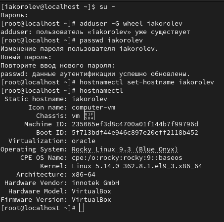
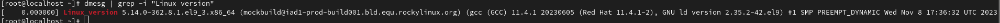
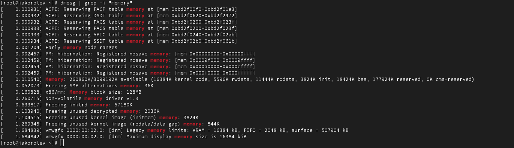
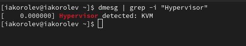
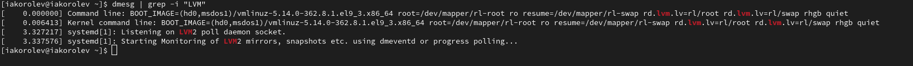
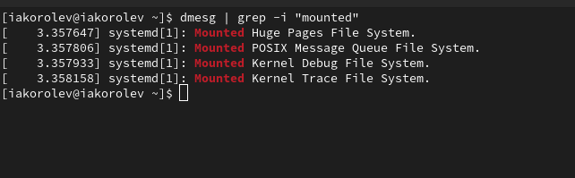

---
## Front matter
lang: ru-RU
title: Презентация по лабораторной работе № 1
author:
  - Королёв Иван Андреевич
institute:
  - Российский университет дружбы народов, Москва, Россия

## i18n babel
babel-lang: russian
babel-otherlangs: english

## Formatting pdf
toc: false
toc-title: Содержание
slide_level: 2
aspectratio: 169
section-titles: true
theme: metropolis
header-includes:
 - \metroset{progressbar=frametitle,sectionpage=progressbar,numbering=fraction}
 - '\makeatletter'
 - '\beamer@ignorenonframefalse'
 - '\makeatother'
---

## Докладчик

:::::::::::::: {.columns align=center}
::: {.column width="70%"}

  * Королёв Иван АНдреевич
  * Студент
  * Российский университет дружбы народов
  * [1032225751@pfur.ru]

:::
::: {.column width="30%"}

:::
::::::::::::::

# Цель работы

Целью данной работы является приобретение практических навыков
установки операционной системы на виртуальную машину, настройки ми-
нимально необходимых для дальнейшей работы сервисов.

# Задание

Установка и настройка Rocky

# Теоретическое введение

Лабораторная работа подразумевает установку на виртуальную машину
VirtualBox (https://www.virtualbox.org/) операционной системы Linux
(дистрибутив Rocky (https://rockylinux.org/)).
Выполнение работы возможно как в дисплейном классе факультета
физико-математических и естественных наук РУДН, так и дома. Описание
выполнения работы приведено для дисплейного класса со следующими ха-
рактеристиками:
– Intel Core i3-550 3.2 GHz, 4 GB оперативной памяти, 20 GB свободного
места на жёстком диске;
– ОС Linux Gentoo (http://www.gentoo.ru/);
– VirtualBox верс. 6.1 или старше;
– каталог с образами ОС для работающих в дисплейном классе:
/afs/dk.sci.pfu.edu.ru/common/files/iso/.

# Выполнение лабораторной работы

## Скачивание и установка Rocky

Скачиваю необходимый iso-образ, в virtualbox нажимаю "машина", "создать новую машину". Далее необходимо будет дать название машине, выделить оперативную память, количество ядер, память для жесткого диска и тд, после начинается обычная установка (Выбор часового пояса, языка и диска, на который будет установка.

## Установка имени пользователя и названия хоста(рис. @fig:001).

{#fig:001 width=70%}

## Домашнее задание(рис. @fig:002).

{#fig:002 width=70%}

## Частота процессора (Detected Mhz processor)(рис. @fig:003).

{#fig:003 width=70%}

## Модель процессора (CPU0).(рис. @fig:004).

{#fig:004 width=70%}

## Объем доступной оперативной памяти (Memory available).(рис. @fig:005).

{#fig:005 width=70%}

## Тип обнаруженного гипервизора (Hypervisor detected).(рис. @fig:006).

{#fig:006 width=70%}

## Тип файловой системы корневого раздела.(рис. @fig:007).

{#fig:007 width=70%}

## Последовательность монтирования файловых систем.(рис. @fig:008).

{#fig:008 width=70%}

# Выводы

Я научился установки операционной системы на виртуальную машину, настройки ми-
нимально необходимых для дальнейшей работы сервисов.

:::
---
