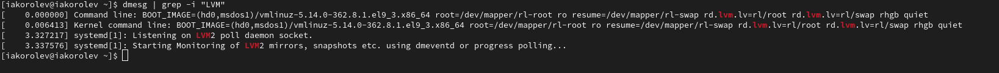

---
## Front matter
subtitle: "Лабораторная работа №1"
author: "Королёв Иван АНдреевич"

## Generic otions
lang: ru-RU
toc-title: "Содержание"

## Bibliography
bibliography: bib/cite.bib
csl: pandoc/csl/gost-r-7-0-5-2008-numeric.csl

## Pdf output format
toc: true # Table of contents
toc-depth: 2
lof: true # List of figures
lot: true # List of tables
fontsize: 12pt
linestretch: 1.5
papersize: a4
documentclass: scrreprt
## I18n polyglossia
polyglossia-lang:
  name: russian
  options:
	- spelling=modern
	- babelshorthands=true
polyglossia-otherlangs:
  name: english
## I18n babel
babel-lang: russian
babel-otherlangs: english
## Fonts
mainfont: PT Serif
romanfont: PT Serif
sansfont: PT Sans
monofont: PT Mono
mainfontoptions: Ligatures=TeX
romanfontoptions: Ligatures=TeX
sansfontoptions: Ligatures=TeX,Scale=MatchLowercase
monofontoptions: Scale=MatchLowercase,Scale=0.9
## Biblatex
biblatex: true
biblio-style: "gost-numeric"
biblatexoptions:
  - parentracker=true
  - backend=biber
  - hyperref=auto
  - language=auto
  - autolang=other*
  - citestyle=gost-numeric
## Pandoc-crossref LaTeX customization
figureTitle: "Рис."
tableTitle: "Таблица"
listingTitle: "Листинг"
lofTitle: "Список иллюстраций"
lotTitle: "Список таблиц"
lolTitle: "Листинги"
## Misc options
indent: true
header-includes:
  - \usepackage{indentfirst}
  - \usepackage{float} # keep figures where there are in the text
  - \floatplacement{figure}{H} # keep figures where there are in the text
---

# Цель работы

Целью данной работы является приобретение практических навыков
установки операционной системы на виртуальную машину, настройки ми-
нимально необходимых для дальнейшей работы сервисов.

# Задание

Установка и настройка Rocky

# Теоретическое введение

Лабораторная работа подразумевает установку на виртуальную машину
VirtualBox (https://www.virtualbox.org/) операционной системы Linux
(дистрибутив Rocky (https://rockylinux.org/)).
Выполнение работы возможно как в дисплейном классе факультета
физико-математических и естественных наук РУДН, так и дома. Описание
выполнения работы приведено для дисплейного класса со следующими ха-
рактеристиками:
– Intel Core i3-550 3.2 GHz, 4 GB оперативной памяти, 20 GB свободного
места на жёстком диске;
– ОС Linux Gentoo (http://www.gentoo.ru/);
– VirtualBox верс. 6.1 или старше;
– каталог с образами ОС для работающих в дисплейном классе:
/afs/dk.sci.pfu.edu.ru/common/files/iso/.

# Выполнение лабораторной работы

## Скачивание и установка Rocky

Скачиваю необходимый iso-образ, в virtualbox нажимаю "машина", "создать новую машину". Далее необходимо будет дать название машине, выделить оперативную память, количество ядер, память для жесткого диска и тд, после начинается обычная установка (Выбор часового пояса, языка и диска, на который будет установка.

## Установка имени пользователя и названия хоста

Ввожу необходимые команды (рис. @fig:001).

{#fig:001 width=70%}

## Домашнее задание

1. Версия ядра(рис. @fig:002).

{#fig:002 width=70%}

2. Частота процессора (Detected Mhz processor)(рис. @fig:003).

{#fig:003 width=70%}

3. Модель процессора (CPU0).(рис. @fig:004).

{#fig:004 width=70%}

4. Объем доступной оперативной памяти (Memory available).(рис. @fig:005).

{#fig:005 width=70%}

5. Тип обнаруженного гипервизора (Hypervisor detected).(рис. @fig:006).

{#fig:006 width=70%}

6. Тип файловой системы корневого раздела.(рис. @fig:007).

{#fig:007 width=70%}

7. Последовательность монтирования файловых систем.(рис. @fig:008).

{#fig:008 width=70%}

# Выводы

Я научился установки операционной системы на виртуальную машину, настройки ми-
нимально необходимых для дальнейшей работы сервисов.

