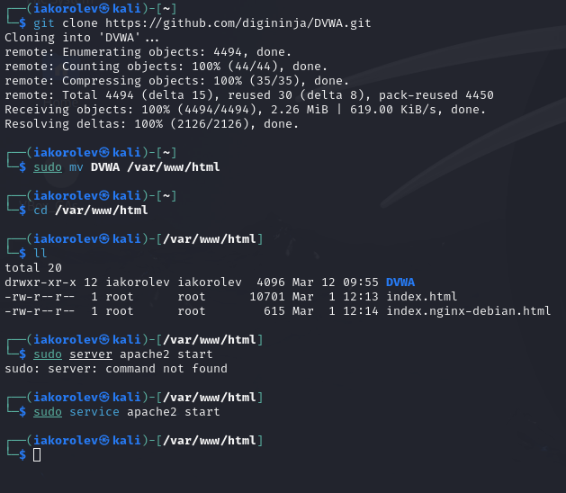
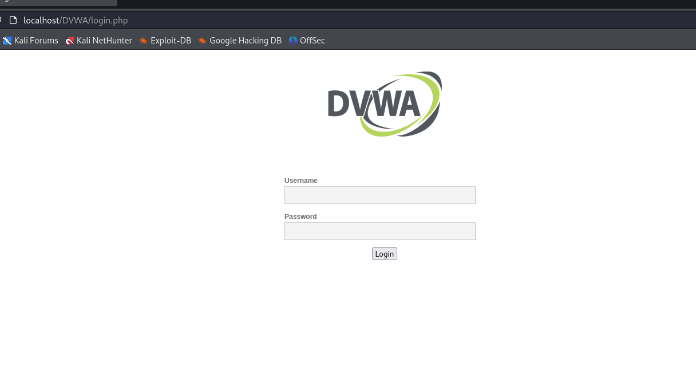

---
## Front matter
lang: ru-RU
title: Индивидуальный проект. Второй этап
author:
  - Королёв Иван Андреевич
institute:
  - Российский университет дружбы народов, Москва, Россия

## i18n babel
babel-lang: russian
babel-otherlangs: english

## Formatting pdf
toc: false
toc-title: Содержание
slide_level: 2
aspectratio: 169
section-titles: true
theme: metropolis
header-includes:
 - \metroset{progressbar=frametitle,sectionpage=progressbar,numbering=fraction}
 - '\makeatletter'
 - '\beamer@ignorenonframefalse'
 - '\makeatother'
---

# Информация

## Докладчик

:::::::::::::: {.columns align=center}
::: {.column width="70%"}

  * Королёв Иван Андреевич
  * студент
  * Российский университет дружбы народов

:::
::: {.column width="30%"}

:::
::::::::::::::

# Цель работы

Установить DVWA в гостевую систему к Kali Linux.

# Задание

Установить DVWA в гостевую систему к Kali Linux. Удалить основные ошибки

# Теоретическое введение

Damn Vulnerable Web Application (DVWA) – это веб-приложение PHP / MySQL, которое чертовски уязвимо.

Его основная цель – помочь специалистам по безопасности проверить свои навыки и инструменты в правовой среде, помочь веб-разработчикам лучше понять процессы обеспечения безопасности веб-приложений и помочь студентам и преподавателям узнать о безопасности веб-приложений в контролируемой среде.

# Выполнение лабораторной работы

# Установка DVWA

{#fig:001 width=70%}

# Установка DVWA

{#fig:002 width=70%}

# Установка DVWA

{#fig:003 width=70%}

{#fig:004 width=70%}

{#fig:005 width=70%}

# Убираем основные ошибки в запуске

{#fig:006 width=70%}

# Выводы

Установил DVWA в гостевую систему к Kali Linux.

# Список литературы{.unnumbered}

::: {#refs}
:::
