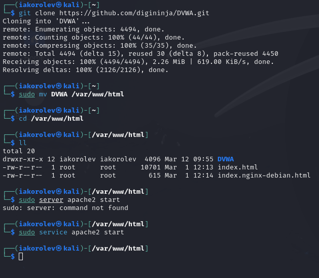
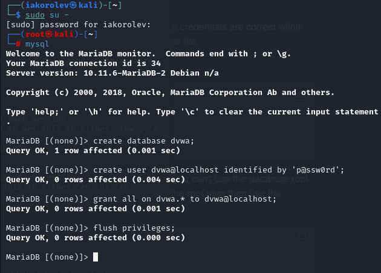
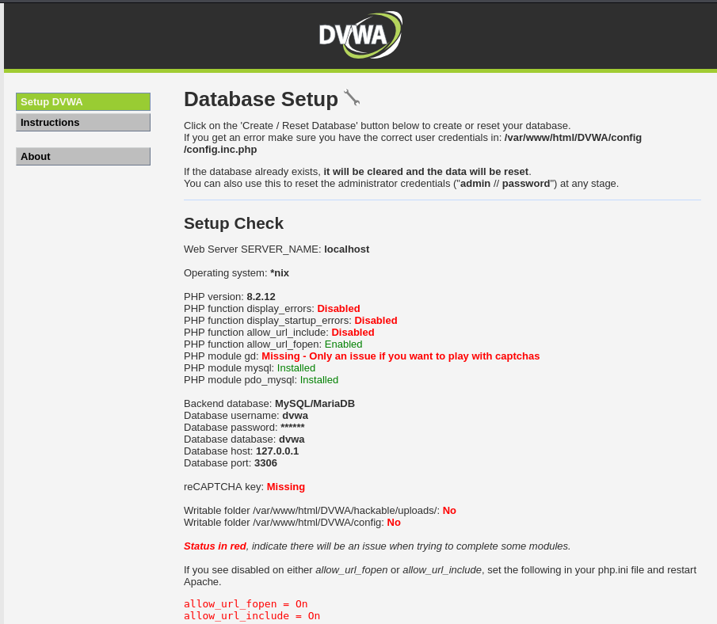
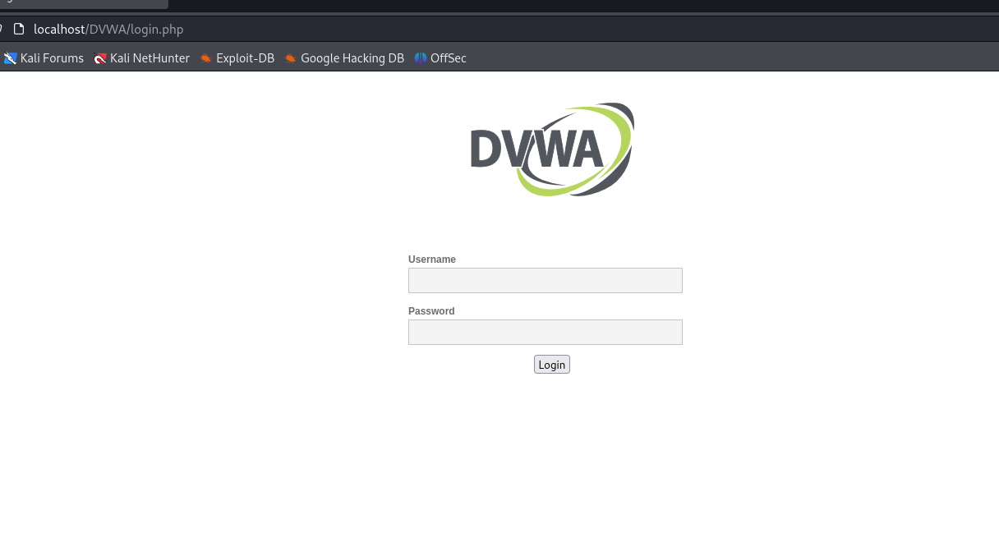
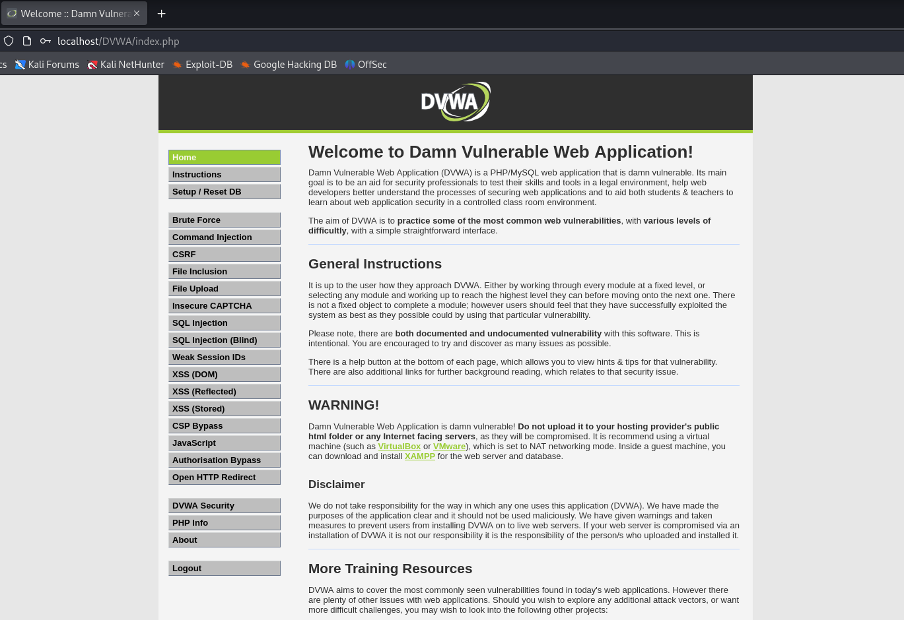
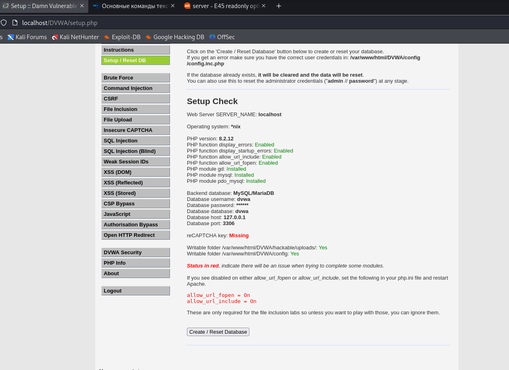

---
## Front matter
title: "Индивидуальный проект. Второй этап"
author: "Королёв Иван Андреевич"

## Generic otions
lang: ru-RU
toc-title: "Содержание"

## Bibliography
bibliography: bib/cite.bib
csl: pandoc/csl/gost-r-7-0-5-2008-numeric.csl

## Pdf output format
toc: true # Table of contents
toc-depth: 2
lof: true # List of figures
lot: true # List of tables
fontsize: 12pt
linestretch: 1.5
papersize: a4
documentclass: scrreprt
## I18n polyglossia
polyglossia-lang:
  name: russian
  options:
	- spelling=modern
	- babelshorthands=true
polyglossia-otherlangs:
  name: english
## I18n babel
babel-lang: russian
babel-otherlangs: english
## Fonts
mainfont: PT Serif
romanfont: PT Serif
sansfont: PT Sans
monofont: PT Mono
mainfontoptions: Ligatures=TeX
romanfontoptions: Ligatures=TeX
sansfontoptions: Ligatures=TeX,Scale=MatchLowercase
monofontoptions: Scale=MatchLowercase,Scale=0.9
## Biblatex
biblatex: true
biblio-style: "gost-numeric"
biblatexoptions:
  - parentracker=true
  - backend=biber
  - hyperref=auto
  - language=auto
  - autolang=other*
  - citestyle=gost-numeric
## Pandoc-crossref LaTeX customization
figureTitle: "Рис."
tableTitle: "Таблица"
listingTitle: "Листинг"
lofTitle: "Список иллюстраций"
lotTitle: "Список таблиц"
lolTitle: "Листинги"
## Misc options
indent: true
header-includes:
  - \usepackage{indentfirst}
  - \usepackage{float} # keep figures where there are in the text
  - \floatplacement{figure}{H} # keep figures where there are in the text
---

# Цель работы

Установить DVWA в гостевую систему к Kali Linux.

# Задание

Установить DVWA в гостевую систему к Kali Linux. Удалить основные ошибки

# Теоретическое введение

Damn Vulnerable Web Application (DVWA) – это веб-приложение PHP / MySQL, которое чертовски уязвимо.

Его основная цель – помочь специалистам по безопасности проверить свои навыки и инструменты в правовой среде, помочь веб-разработчикам лучше понять процессы обеспечения безопасности веб-приложений и помочь студентам и преподавателям узнать о безопасности веб-приложений в контролируемой среде.

# Выполнение лабораторной работы

## Установка DVWA

1. Скачивание DVWA с репозитория github. Перемещаем его в var/www/html и запускаем серввер (рис. [-@fig:001]).

{#fig:001 width=70%}

2. Фиктивную копию файла конфигурации, копирую на место, а затем вношу соответствующие изменения. Подключаемся к базе данных от имени пользователя root, а затем используем следующие команды, показанные на скриншоты (рис. [-@fig:002]).

{#fig:002 width=70%}

3. Проверяем, что пользователь создается и запускаем сервер. (рис. [-@fig:003]), (рис. [-@fig:004]), (рис. [-@fig:005])

{#fig:003 width=70%}

{#fig:004 width=70%}

{#fig:005 width=70%}

## Убираем основные ошибки в запуске

На видео демонстрирую исправление основных ошибок. Прикрепляю скриншот, что всё ошибки убраны. (рис. [-@fig:006])

{#fig:006 width=70%}

# Выводы

Установил DVWA в гостевую систему к Kali Linux.

# Список литературы{.unnumbered}

::: {#refs}
:::
