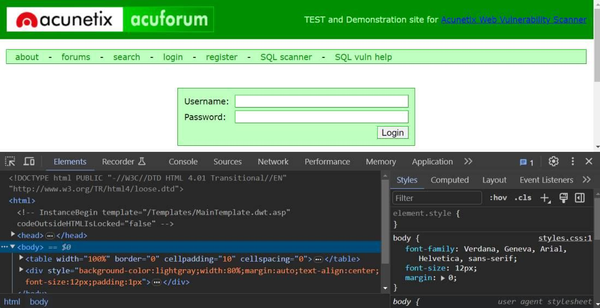
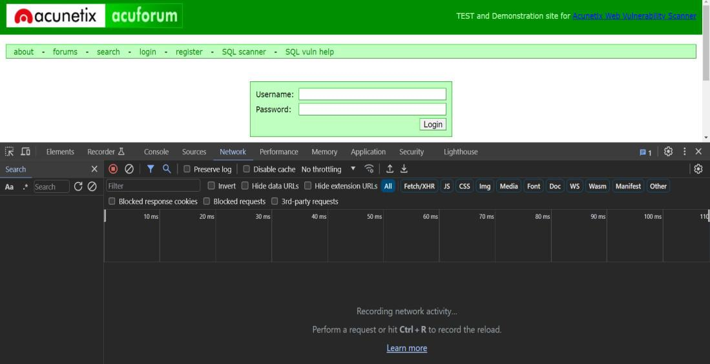
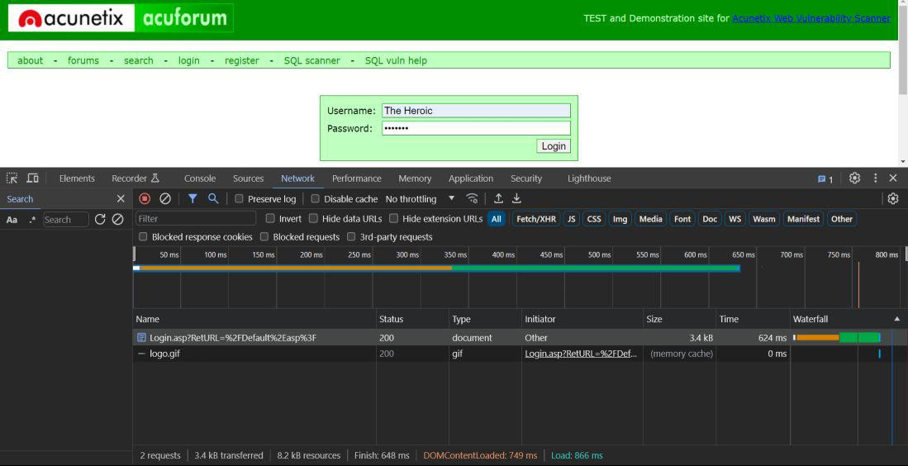
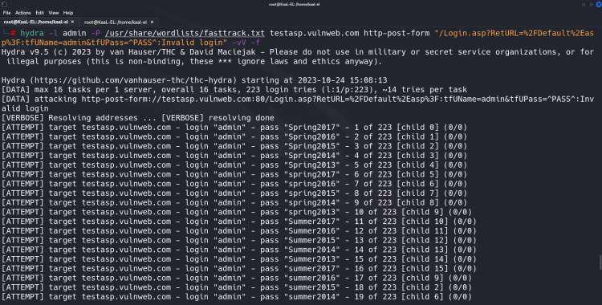
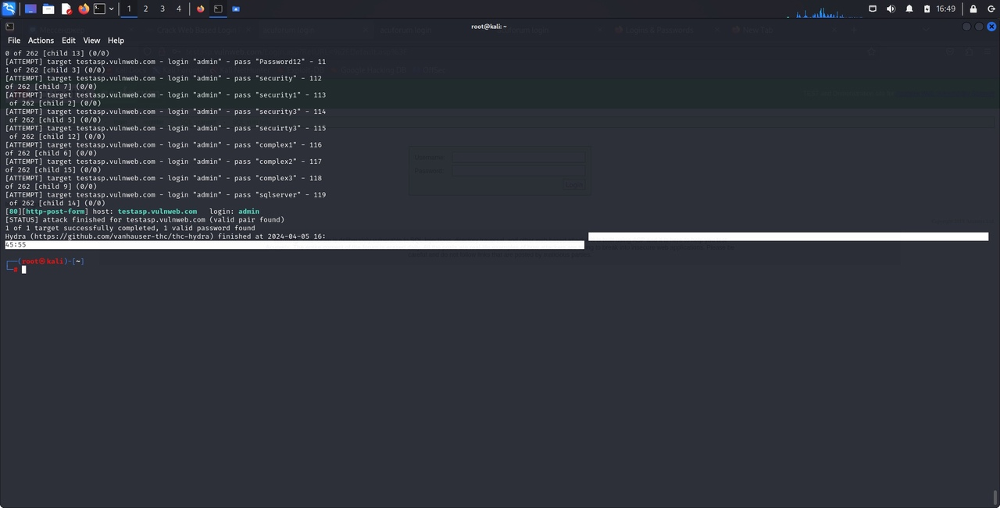

---
## Front matter
lang: ru-RU
title: Индивидуальный проект. Третий этап
author:
  - Королёв Иван Андреевич
institute:
  - Российский университет дружбы народов, Москва, Россия

## i18n babel
babel-lang: russian
babel-otherlangs: english

## Formatting pdf
toc: false
toc-title: Содержание
slide_level: 2
aspectratio: 169
section-titles: true
theme: metropolis
header-includes:
 - \metroset{progressbar=frametitle,sectionpage=progressbar,numbering=fraction}
 - '\makeatletter'
 - '\beamer@ignorenonframefalse'
 - '\makeatother'
---

# Информация

## Докладчик

:::::::::::::: {.columns align=center}
::: {.column width="70%"}

  * Королёв Иван Андреевич
  * студент
  * Российский университет дружбы народов

:::
::: {.column width="30%"}

:::
::::::::::::::

# Цель работы

Использовать hydra

# Задание

Подобрать логин и пароль к сайту

# Теоретическое введение

Hydra – это программное обеспечение с открытым исходным кодом для перебора паролей в реальном времени от различных онлайн сервисов, веб-приложений, FTP, SSH и других протоколов. Это распараллеленный взломщик для входа в систему, он поддерживает множество протоколов для осуществления атак.

# Выполнение лабораторной работы

## Проверка веб-сайта 

{#fig:001 width=70%}

## Проверка вкладки Сеть

{#fig:002 width=70%}

## Получение параметров POST

{#fig:003 width=70%}

## Запустите Hydra

{#fig:004 width=70%}

## Запустите Hydra

{#fig:005 width=70%}

# Выводы

Неэтично и незаконно использовать Hydra для попытки взлома веб-системы входа или любой другой системы без надлежащей авторизации. Это нарушение конфиденциальности и компьютерной безопасности, и это может привести к серьезным последствиям, таким как судебный иск и уголовные обвинения. Важно предупредить соответствующие органы или владельца системы, если у вас есть какие-либо опасения или подозрения по поводу безопасности страницы входа или системы. Безопасность может быть повышена за счет этичного и ответственного раскрытия информации без нарушения закона или моральных обязательств.# Список литературы{.unnumbered}

# Список литературы{.unnumbered}

::: {#refs}
:::
