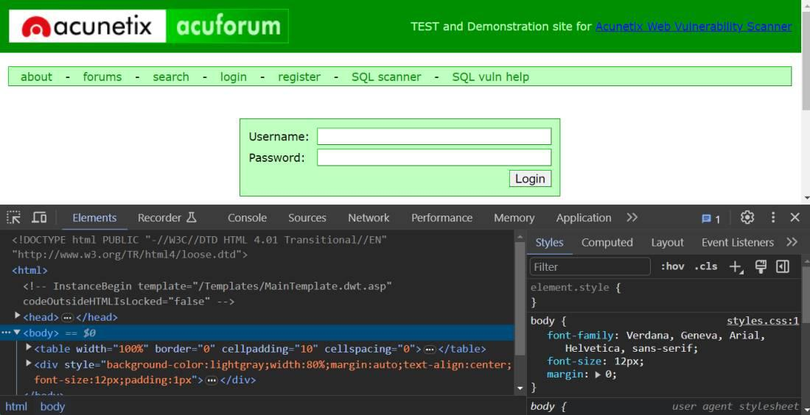
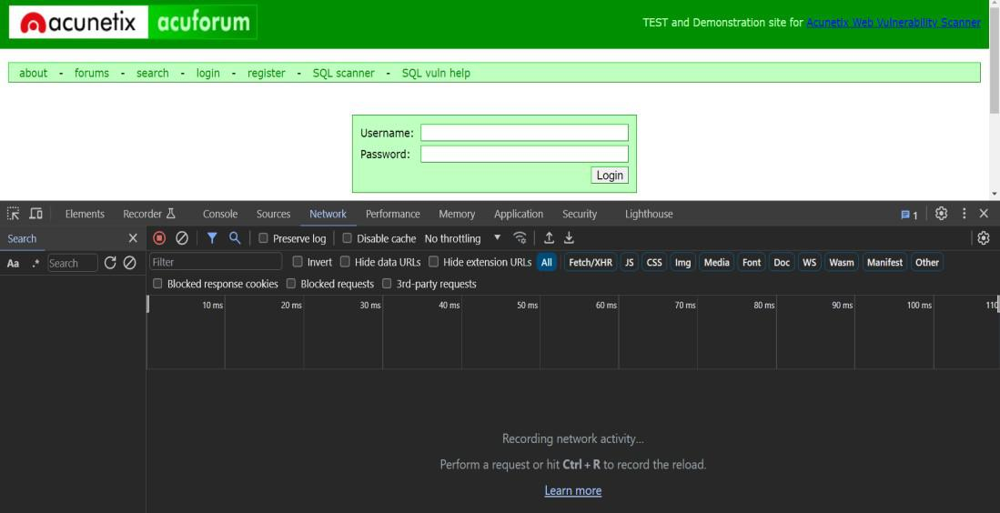
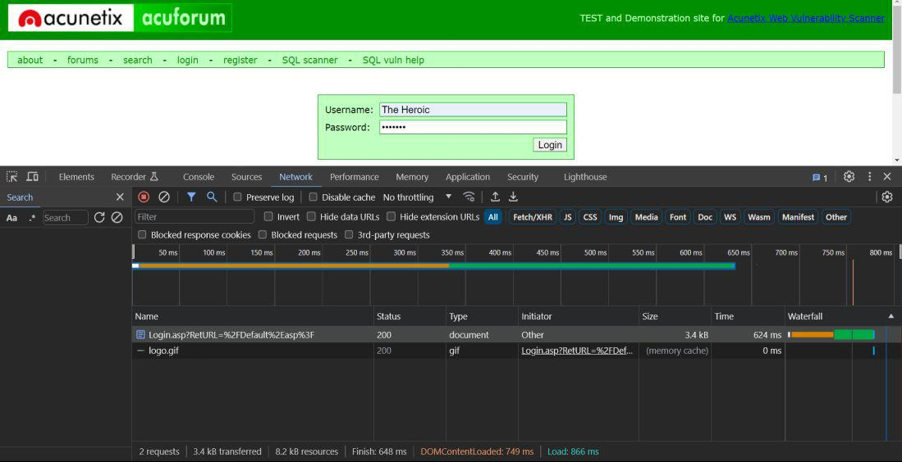
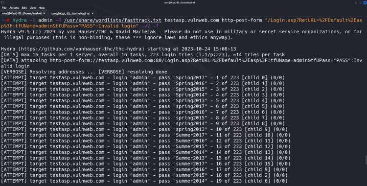
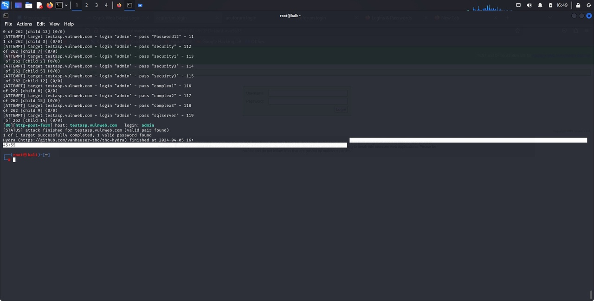

---
## Front matter
title: "Индивидуальный проект. Третий этап"
author: "Королёв Иван Андреевич"

## Generic otions
lang: ru-RU
toc-title: "Содержание"

## Bibliography
bibliography: bib/cite.bib
csl: pandoc/csl/gost-r-7-0-5-2008-numeric.csl

## Pdf output format
toc: true # Table of contents
toc-depth: 2
lof: true # List of figures
lot: true # List of tables
fontsize: 12pt
linestretch: 1.5
papersize: a4
documentclass: scrreprt
## I18n polyglossia
polyglossia-lang:
  name: russian
  options:
	- spelling=modern
	- babelshorthands=true
polyglossia-otherlangs:
  name: english
## I18n babel
babel-lang: russian
babel-otherlangs: english
## Fonts
mainfont: PT Serif
romanfont: PT Serif
sansfont: PT Sans
monofont: PT Mono
mainfontoptions: Ligatures=TeX
romanfontoptions: Ligatures=TeX
sansfontoptions: Ligatures=TeX,Scale=MatchLowercase
monofontoptions: Scale=MatchLowercase,Scale=0.9
## Biblatex
biblatex: true
biblio-style: "gost-numeric"
biblatexoptions:
  - parentracker=true
  - backend=biber
  - hyperref=auto
  - language=auto
  - autolang=other*
  - citestyle=gost-numeric
## Pandoc-crossref LaTeX customization
figureTitle: "Рис."
tableTitle: "Таблица"
listingTitle: "Листинг"
lofTitle: "Список иллюстраций"
lotTitle: "Список таблиц"
lolTitle: "Листинги"
## Misc options
indent: true
header-includes:
  - \usepackage{indentfirst}
  - \usepackage{float} # keep figures where there are in the text
  - \floatplacement{figure}{H} # keep figures where there are in the text
---

# Цель работы

Использовать hydra

# Задание

Подобрать логин и пароль к сайту

# Теоретическое введение

Hydra – это программное обеспечение с открытым исходным кодом для перебора паролей в реальном времени от различных онлайн сервисов, веб-приложений, FTP, SSH и других протоколов. Это распараллеленный взломщик для входа в систему, он поддерживает множество протоколов для осуществления атак.

# Выполнение лабораторной работы

## Проверка веб-сайта

1. Дополнительные инструменты > Инструменты разработчика. (рис. [-@fig:001]).

{#fig:001 width=70%}

## Проверка вкладки Сеть

2. Перейдите на вкладку Сеть, чтобы просмотреть входящие файлы и информацию. Если на вкладке ничего не отображается, это означает, что мы еще не РАЗМЕСТИЛИ какие-либо данные. (рис. [-@fig:002]).

{#fig:002 width=70%}

## Получение параметров POST

3. Чтобы получить параметры post-формы, введите имя пользователя и / или пароль в форме входа, какие вам нравятся, а затем нажмите “Войти”. Вы заметите новый метод публикации на вкладке сеть в консоли разработчика. (рис. [-@fig:003]).

{#fig:003 width=70%}

## Запустите Hydra

3. Введите приведенную выше команду, нажмите Enter, и пусть Hydra попытается взломать пароль для нас. Поскольку это атака на основе словаря, это займет время. Когда он найдет правильную комбинацию имени пользователя и пароля, он остановит все последующие попытки входа в систему и отобразит обнаруженные им правильные учетные данные. (рис. [-@fig:004]), (рис. [-@fig:005])

{#fig:004 width=70%}

{#fig:005 width=70%}

# Выводы

Неэтично и незаконно использовать Hydra для попытки взлома веб-системы входа или любой другой системы без надлежащей авторизации. Это нарушение конфиденциальности и компьютерной безопасности, и это может привести к серьезным последствиям, таким как судебный иск и уголовные обвинения. Важно предупредить соответствующие органы или владельца системы, если у вас есть какие-либо опасения или подозрения по поводу безопасности страницы входа или системы. Безопасность может быть повышена за счет этичного и ответственного раскрытия информации без нарушения закона или моральных обязательств.

# Список литературы{.unnumbered}

:::
